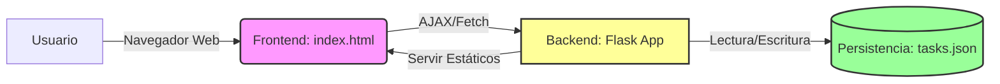

# Documentación Técnica: Tablero Kanban

## Visión General del Proyecto

Este proyecto es una aplicación web de gestión de tareas estilo Kanban, diseñada para ser ligera, autocontenida y fácil de desplegar. La aplicación permite a los usuarios crear, editar, mover y eliminar tarjetas de tareas a través de tres estados definidos: "Por Hacer", "En Progreso" y "Hecho".

La solución sigue una arquitectura monolítica simple donde el frontend y el backend conviven en el mismo proyecto. El backend está construido con Flask, un framework ligero para Python, que expone una API RESTful para gestionar la lógica de negocio. La persistencia de datos se maneja mediante un archivo JSON local (`tasks.json`), lo que elimina la necesidad de configurar una base de datos externa compleja para esta fase inicial.

El frontend es una Single Page Application (SPA) contenida en un único archivo HTML que utiliza Bootstrap 5 para el diseño responsivo y JavaScript vainilla para la lógica de interacción. Una de las características clave es la implementación de la funcionalidad "Drag and Drop" (arrastrar y soltar) nativa del navegador, permitiendo a los usuarios cambiar el estado de las tareas de manera intuitiva arrastrando las tarjetas entre las columnas visuales.

## Arquitectura del Sistema

El sistema se divide en dos componentes principales que se comunican a través de HTTP:

1.  **Backend (Flask):** Se encarga de servir los archivos estáticos y exponer los endpoints de la API. Utiliza el patrón "Application Factory" para la creación de la instancia de la aplicación.
2.  **Frontend (HTML/CSS/JS):** Consume la API REST para renderizar el tablero y gestionar las interacciones del usuario en el lado del cliente.

### Diagrama de Arquitectura



### Estructura de Directorios

El código fuente sigue una estructura estándar para aplicaciones Flask pequeñas:

```
.
├── app.py                      # Punto de entrada y ejecución
├── requirements.txt            # Dependencias de Python
├── plan_construccion.json      # Especificación y plan del proyecto
├── backend/
│   ├── __init__.py             # Factory de la app Flask y configuración
│   └── routes.py               # Blueprint de la API y lógica de datos
├── frontend/
│   └── index.html              # Interfaz de usuario completa (HTML/CSS/JS)
└── tests/
    └── test_backend.py         # Suite de pruebas unitarias
```

## Endpoints de la API

La API sigue un esquema RESTful bajo la ruta base `/api/tasks`. A continuación se detallan los endpoints disponibles:

| Método | Ruta | Descripción | Payload de Entrada | Respuesta de Éxito |
| :--- | :--- | :--- | :--- | :--- |
| **GET** | `/api/tasks` | Recupera la lista completa de tareas almacenadas. | Ninguno | `200 OK` (Array JSON de tareas) |
| **POST** | `/api/tasks` | Crea una nueva tarea. El estado por defecto es "Por Hacer". | <pre>{<br>  "content": "string",<br>  "state": "string (opcional)"<br>}</pre> | `201 Created` (Objeto Tarea JSON) |
| **PUT** | `/api/tasks/<id>` | Actualiza el contenido o el estado de una tarea existente. | <pre>{<br>  "content": "string (opcional)",<br>  "state": "string (opcional)"<br>}</pre> | `200 OK` (Objeto Tarea actualizado) |
| **DELETE** | `/api/tasks/<id>` | Elimina permanentemente una tarea por su identificador único. | Ninguno | `204 No Content` |

### Esquema de Datos (Tarea)

| Campo | Tipo | Descripción |
| :--- | :--- | :--- |
| `id` | Integer | Identificador único autogenerado (secuencial). |
| `content` | String | Texto descriptivo de la tarea. |
| `state` | String | Estado actual de la tarea ("Por Hacer", "En Progreso", "Hecho"). |

## Instrucciones de Instalación y Ejecución

Para poner en marcha el proyecto en un entorno de desarrollo local, siga estos pasos:

1.  **Asegúrese de tener Python instalado** (se recomienda versión 3.6 o superior).
2.  **Cree un entorno virtual** (opcional pero recomendado):
    ```bash
    python -m venv venv
    # En Windows:
    venv\Scripts\activate
    # En Unix/MacOS:
    source venv/bin/activate
    ```
3.  **Instale las dependencias** necesarias utilizando el archivo `requirements.txt`:
    ```bash
    pip install -r requirements.txt
    ```
4.  **Ejecute la aplicación** utilizando el script principal:
    ```bash
    python app.py
    ```
5.  **Acceda a la aplicación** abriendo su navegador web y navegando a:
    `http://localhost:5000`

**Ejecución de Pruebas:**
Para verificar el correcto funcionamiento del backend, puede ejecutar la suite de pruebas unitarias:
```bash
    pytest
```

## Flujo de Datos Clave

El flujo de datos más relevante y característico de esta aplicación es la **actualización del estado de una tarea mediante "Drag and Drop"**. A diferencia de una aplicación tradicional que enviaría el formulario completo, aquí la interacción es asíncrona y se basa en eventos del navegador.

El proceso comienza cuando el usuario inicia el arrastre de una tarjeta. El evento `dragstart` de JavaScript captura el ID de la tarea y lo almacena temporalmente. Visualmente, la tarjeta adquiere una opacidad reducida para indicar que está siendo movida.

Cuando el usuario suelta la tarjeta sobre una columna diferente (por ejemplo, mueve una tarea de "Por Hacer" a "En Progreso"), se dispara el evento `drop` en el elemento de la columna contenedora. El script JavaScript lee el estado asociado a esa columna (definido en el atributo `data-estado`) y construye una petición asíncrona (AJAX) tipo `PUT` hacia la URL `/api/tasks/<id>`.

Esta petición viaja al servidor Flask, donde el endpoint correspondiente localiza la tarea en el archivo `tasks.json` por su ID, actualiza el campo `state` y guarda los cambios en disco. El servidor responde con un código 200 OK y el objeto actualizado. Tras recibir la confirmación, el cliente realiza una recarga completa de los datos (llamada a `GET /api/tasks`) para asegurar que la interfaz refleja fielmente el estado persistente en el servidor, garantizando la consistencia e inmediatamente re-renderizando el tablero.

## Extensiones Futuras

Basándonos en el archivo `plan_construccion.json` y la arquitectura actual, se identifican las siguientes áreas para expansión y mejora continua:

1.  **Implementación de Pruebas E2E:** El plan de construcción menciona explícitamente la creación de pruebas Cypress en `cypress/e2e/kanban.cy.js`. Actualmente, solo existen pruebas unitarias del backend. El siguiente paso lógico es configurar Cypress para simular interacciones reales de usuario (creación, arrastre, eliminación) y asegurar la estabilidad de la interfaz.
2.  **Mejora de la Persistencia (Base de Datos):** El uso de un archivo JSON (`tasks.json`) es funcional para prototipos y baja carga, pero presenta problemas de concurrencia y rendimiento. Se recomienda migrar a una base de datos ligera como SQLite o integrar SQLAlchemy para soportar transacciones ACID y un mayor volumen de datos.
3.  **Refactorización del Frontend:** Separar el código JavaScript y CSS del HTML (`frontend/index.html`) en archivos dedicados (`.js` y `.css`). Esto mejoraría la mantenibilidad del código, permitiría el uso de herramientas de minificación y facilitaría la escalabilidad de la interfaz.
4.  **Validaciones y Seguridad:** Implementar autenticación de usuarios para que cada persona tenga su propio tablero. Además, se deberían añadir validaciones más robustas en el backend (ej. longitud máxima del contenido) y sanitización de inputs para prevenir inyecciones de código.