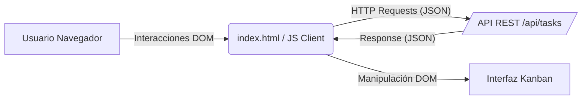

# Documentación Técnica del Tablero Kanban

## Visión General del Proyecto

Este proyecto consiste en una aplicación web de gestión de tareas diseñada bajo la metodología Kanban, permitiendo a los usuarios visualizar, organizar y rastrear el progreso de sus actividades a través de un tablero interactivo. La interfaz se presenta como una Single Page Application (SPA) contenida en un único archivo HTML, diseñada para ofrecer una experiencia de usuario fluida y moderna sin la necesidad de recargas de página constantes.

La aplicación divide el flujo de trabajo en tres estados fundamentales: "Por Hacer", "En Progreso" y "Hecho". La interacción principal se basa en una implementación nativa de *Drag and Drop* (arrastrar y soltar), lo que permite a los usuarios mover tareas entre columnas de manera intuitiva. Además, el sistema ofrece capacidades completas de Crear, Leer, Actualizar y Eliminar (CRUD) para las tarjetas de tareas, integrando retroalimentación visual inmediata mediante alertas dinámicas para confirmar acciones o reportar errores. El diseño estético utiliza Bootstrap 5 para garantizar una apariencia limpia, responsiva y profesional.

## Arquitectura del Sistema

El sistema sigue una arquitectura cliente-servidor clásica, donde la lógica de presentación y manipulación del DOM reside íntegramente en el cliente, mientras que la persistencia de datos y la lógica de negocio se delegan a una API RESTful externa. El código frontend es modular en su estructura lógica, separando la gestión del estado, el renderizado de la interfaz y el manejo de eventos.

A continuación, se presenta la relación de componentes y el flujo de comunicación de alto nivel:



### Stack Tecnológico

| Capa | Tecnología | Versión | Descripción |
| :--- | :--- | :--- | :--- |
| **Frontend** | HTML5 | - | Estructura semántica de la página. |
| **Frontend** | CSS3 | - | Estilos personalizados y Bootstrap. |
| **Framework UI** | Bootstrap | 5.3.3 | Sistema de rejilla, componentes y utilidades responsive. |
| **Lógica Cliente** | JavaScript (Vanilla) | ES6+ | Manipulación del DOM, asíncronía y eventos. |
| **Comunicación** | Fetch API | - | Realización de peticiones HTTP asíncronas al servidor. |

## Endpoints de la API

El cliente JavaScript interactúa con un backend a través de una serie de endpoints RESTful bien definidos. Aunque el código backend no se encuentra en el contexto proporcionado, la siguiente tabla detalla la especificación del contrato API que el cliente implementa y consume, inferida a partir de las llamadas `fetch` en el código fuente.

| Método HTTP | Endpoint | Descripción | Payload (Cuerpo de la petición) | Respuesta Esperada |
| :--- | :--- | :--- | :--- | :--- |
| **GET** | `/api/tasks` | Recupera la lista completa de todas las tareas. | N/A | Array JSON de objetos `tarea`. |
| **POST** | `/api/tasks` | Crea una nueva tarea en el estado "Por Hacer". | <pre>{<br>  "content": "String",<br>  "state": "Por Hacer"<br>}</pre> | Objeto JSON de la tarea creada (con ID). |
| **PUT** | `/api/tasks/:id` | Actualiza el contenido o el estado de una tarea existente. | <pre>{ "content": "Nuevo texto" }</pre><br>o<br><pre>{ "state": "En Progreso" }</pre> | Objeto JSON de la tarea actualizada. |
| **DELETE** | `/api/tasks/:id` | Elimina permanentemente una tarea por su ID. | N/A | Confirmación de éxito (usualmente 204 No Content). |

## Instrucciones de Instalación y Ejecución

Dado que el proyecto se distribuye como un fichero HTML estático que depende de recursos externos (CDN de Bootstrap) y de un servidor API local, siga estos pasos para desplegar la aplicación en un entorno de desarrollo:

1.  **Asegurar la disponibilidad del API Backend:**
    Antes de ejecutar el cliente, asegúrese de que el servidor API está corriendo y escuchando peticiones en la ruta `/api/tasks` (ej. `http://localhost:3000/api/tasks`). Sin este servicio, la aplicación cargará la interfaz pero no podrá obtener ni guardar datos.

2.  **Crear el directorio del proyecto:**
    ```bash
    mkdir tablero-kanban
    cd tablero-kanban
    ```

3.  **Crear el fichero del proyecto:**
    Copie el contenido del código fuente proporcionado en el contexto y guárdelo en un fichero denominado `index.html` dentro del directorio creado.

4.  **Servir la aplicación:**
    Para evitar problemas de CORS (Cross-Origin Resource Sharing) con las peticiones `fetch`, es recomendable servir el fichero HTML a través de un servidor HTTP local en lugar de abrirlo directamente con el protocolo `file://`.
    
    *   *Opción A (Usando Python 3):*
        ```bash
        python3 -m http.server 8080
        ```
    *   *Opción B (Usando Node.js con `http-server`):*
        ```bash
        npx http-server -p 8080
        ```

5.  **Acceso a la aplicación:**
    Abra su navegador web y navegue a `http://localhost:8080`. El tablero Kanban debería cargar las tareas existentes desde el API inmediatamente.

## Flujo de Datos Clave

El ciclo de vida de los datos dentro de la aplicación comienza en el momento en que el documento finaliza su carga. En ese instante, se dispara la función `cargar_tareas`, la cual realiza una petición asíncrona `GET` al servidor. Una vez que el servidor responde con el conjunto de datos en formato JSON, el cliente itera sobre este array y delega a la función `renderizar_tablero` la responsabilidad de inyectar los elementos HTML en el DOM, clasificando cada tarjeta según su propiedad `state` dentro de los contenedores correspondientes (`lista-por-hacer`, `lista-en-progreso`, `lista-hecho`).

Cuando el usuario interactúa con el tablero, específicamente al arrastrar una tarjeta (`dragstart`), el sistema almacena temporalmente el identificador único de la tarea en una variable global. Al soltar la tarjeta en una columna diferente (`drop`), el sistema extrae el nuevo estado definido en el atributo `data-estado` de la columna objetivo. Con esta información, se invoca a `actualizar_estado_tarea`, enviando una petición `PUT` al servidor con el nuevo estado. Solo tras recibir la confirmación exitosa del servidor, el cliente vuelve a invocar `cargar_tareas` para sincronizar la vista con la base de datos, asegurando así la integridad de los datos y reflejando el cambio definitivo en la interfaz.

## Extensiones Futuras

Basándonos en la estructura actual del código y las funcionalidades típicas de un sistema Kanban, se identifican las siguientes extensiones lógicas para futuras iteraciones del proyecto:

*   **Persistencia Local (LocalStorage):** Implementar un mecanismo de caché o fallback que permita guardar las tareas en el almacenamiento local del navegador en caso de que la API `/api/tasks` no esté disponible o falle la conexión, garantizando que la interfaz siga siendo funcional en modo desconectado.
*   **Edición en Línea (Contenteditable):** Sustituir el uso de `window.prompt` para editar las tareas por un sistema de edición en línea dentro de la propia tarjeta o la apertura de un modal Bootstrap, mejorando la experiencia de usuario y la consistencia visual.
*   **Sistema de Usuarios y Autenticación:** Dado que el sistema es un tablero genérico, una extensión natural sería la inclusión de login y registro para permitir que distintos usuarios tengan sus propios tableros privados.
*   **Metadatos de Tarea:** Ampliar el modelo de datos de la tarea para incluir prioridad (baja, media, alta), fecha de vencimiento o etiquetas, visualizándolas mediante badges en la tarjeta.